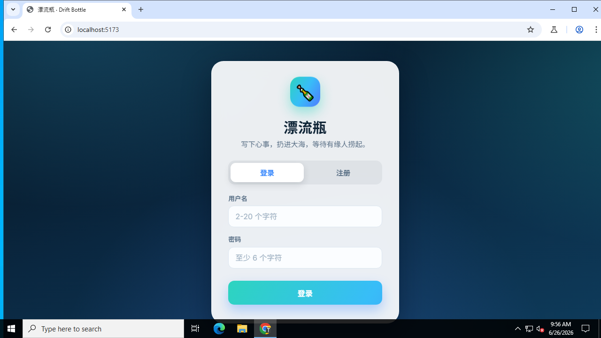
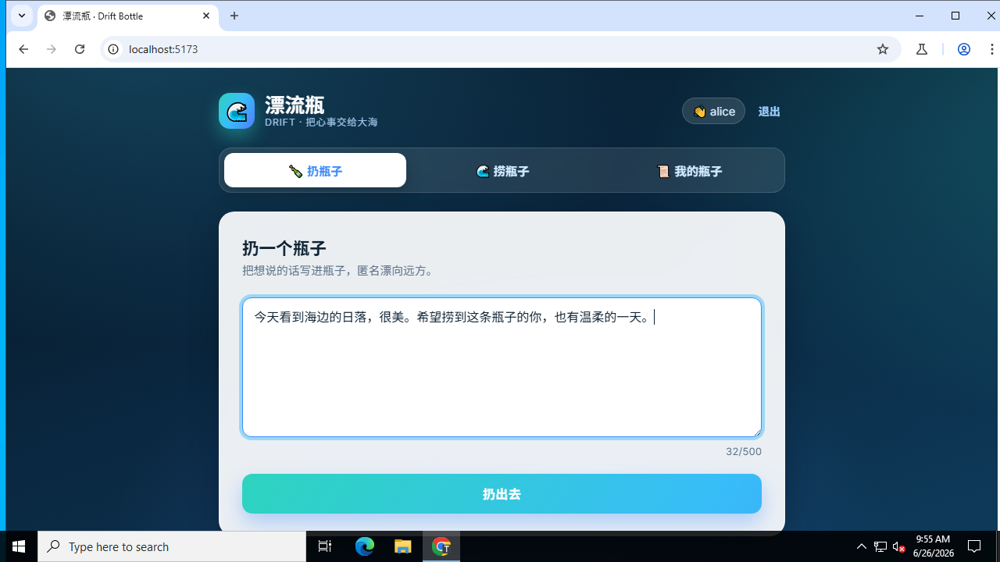
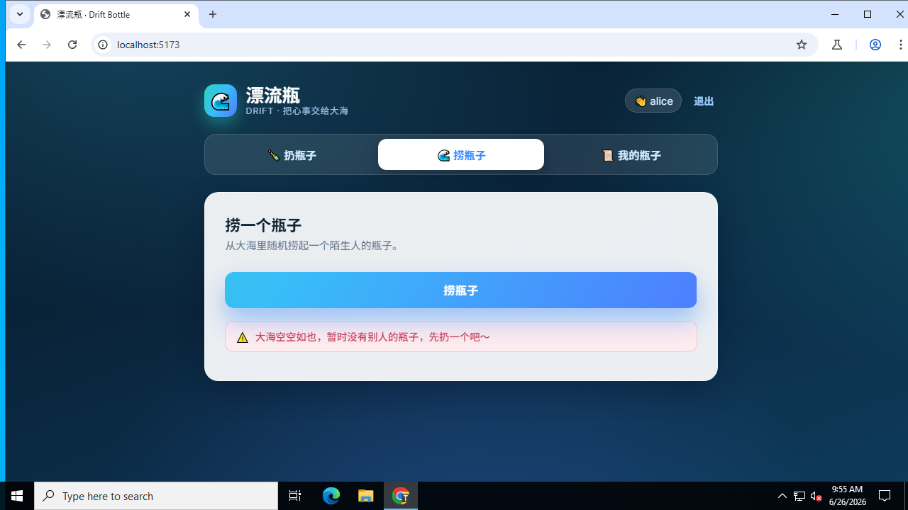
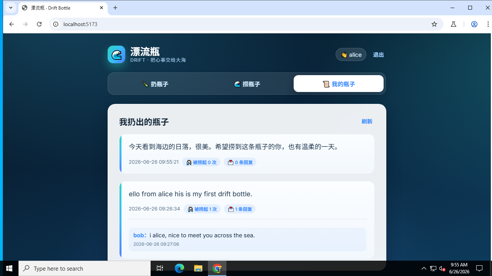

# 漂流瓶 · Drift Bottle

一个「漂流瓶」练手项目：登录后可以匿名扔出一条消息（瓶子），随机捞起别人的瓶子并回复，还能在「我的瓶子」里查看自己的瓶子收到的回复。

- **后端**：Node.js + Express + SQLite（`better-sqlite3`），JWT 账号系统
- **前端**：React + Vite

## 界面预览

玻璃拟态卡片、海洋渐变背景、漂浮气泡动画与微交互。

| 登录 | 扔瓶子 |
| --- | --- |
|  |  |

| 捞瓶子 | 我的瓶子 |
| --- | --- |
|  |  |

## 功能

- 注册 / 登录（JWT，密码用 bcrypt 加密存储）
- 扔瓶子：匿名发出一条消息
- 捞瓶子：随机捞起一条「别人」的瓶子（不会捞到自己的）
- 回复瓶子
- 我的瓶子：查看自己扔出的瓶子、被捞次数和收到的回复

## 目录结构

```
driftbottle/
├── server/          # Express + SQLite 后端 API
│   └── src/
│       ├── index.js         # 入口
│       ├── db.js            # SQLite 初始化与建表
│       ├── auth.js          # JWT 签发/校验
│       ├── middleware/      # requireAuth 鉴权中间件
│       └── routes/          # auth、bottles 路由
└── client/          # React + Vite 前端
    └── src/
        ├── AuthContext.jsx  # 登录态管理
        ├── api.js           # fetch 封装
        └── pages/           # 登录、扔/捞/我的瓶子页面
```

## 本地运行

需要 Node.js 18+（推荐 20）。

### 1. 安装依赖

```bash
npm run install:all
```

> 等价于在根目录、`server/`、`client/` 分别执行 `npm install`。

### 2. 配置后端环境变量（可选）

复制 `server/.env.example` 为 `server/.env`，按需修改：

```
PORT=4000
JWT_SECRET=请改成一段足够长的随机字符串
CLIENT_ORIGIN=http://localhost:5173
```

不配置也能跑，会使用默认值（仅适合本地开发）。

### 3. 启动（前后端一起）

```bash
npm run dev
```

- 后端：http://localhost:4000
- 前端：http://localhost:5173

前端通过 Vite 代理把 `/api` 请求转发到后端，直接访问 http://localhost:5173 即可。

也可以分别启动：

```bash
npm run dev:server
npm run dev:client
```

## API 一览

| 方法 | 路径 | 说明 | 需登录 |
| --- | --- | --- | --- |
| POST | `/api/auth/register` | 注册 | 否 |
| POST | `/api/auth/login` | 登录 | 否 |
| GET  | `/api/auth/me` | 获取当前用户 | 是 |
| POST | `/api/bottles` | 扔一个瓶子 | 是 |
| POST | `/api/bottles/catch` | 随机捞一个别人的瓶子 | 是 |
| GET  | `/api/bottles/mine` | 我扔出的瓶子及回复 | 是 |
| POST | `/api/bottles/:id/replies` | 回复某个瓶子 | 是 |

数据库文件保存在 `server/data/driftbottle.sqlite`（已在 `.gitignore` 中忽略）。

## 后续可以扩展的点

- 瓶子防重复打捞（记录每个用户捞过哪些瓶子）
- 打捞频率限制 / 每日次数
- 瓶子分类、标签、举报与内容审核
- 实时通知（收到回复时提醒）
